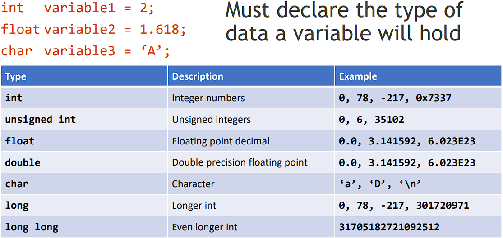
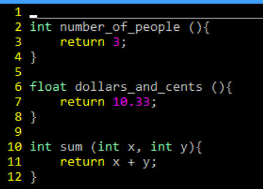
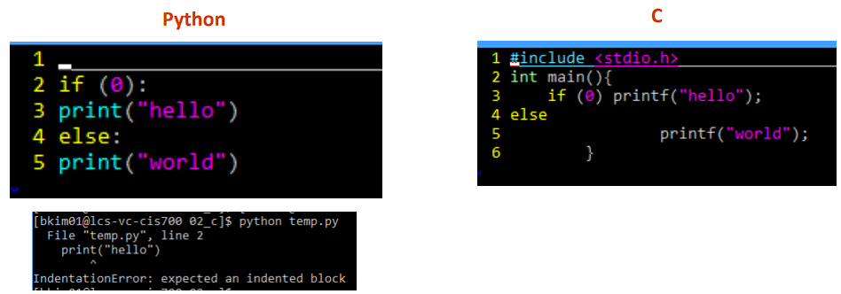

# Lec01-C_Basics

> Some description
>
> Tags: [`CIS 341`](../../view/CIS341/index.md)
>
> Author: `Zekai Lin`
>
> Resently Update: `Oct.4 23` `16:18`

## Hello World in C

``` C

    #include <stdio.h>              // Preprocessor command include

    int main (void){                // Definition for main
        printf(“hello world\n”);    // Calling printf with argument “hello world\n”
        return 0;                   // return the value of main
    }
```

## C syntax - preprocessor

``` C

    #include “file.h”           // include contents of file.h
    #include <stdio.h>        // include contents of stdio.h
    #define M_PI (3.14159)    // define constant
    #if/#endif                // conditional inclusion of text

```

## C syntax - main

When a C program starts:

- C executable a.out is loaded into memory by the operating system
- OS and C runtime library sets up the environment for the program to run,
- Then calls your procedure named main()

## Typed Variables



## Typed Functions

> You need to declare the return type and types of arguments of a function 
> when declaring it.
> 
> You also need to declare functions before they are used.



## Control Flow

Within a function, control flow is remarkably similar to that of Java

### if-else

``` C

    if (expression) statement 
        if (x == 0) y++; 
        if (x == 0) {y++;} 
        if (x == 0) {y++; j = j + y;}
    if (expression) statement1 else statement2
        // There is an ambiguity in a series of if/else if you don’t use {}s, so it’s a good habit to enclose blocks of code with {}

```

### while

``` C
    while (expression) statement
    do statement while (expression)
```

### for

``` C
    for (initialize; condition; update){
        statement
    }
```

## Variable

### Similar to Java, but with a few minor but important differences

- All variable declarations must appear before they are used
- All must be at the beginning of a code block
- A variable may be initialized in its declaration if not, it holds garbage!

### Examples of declaration

- Correct: { int a = 0, b = 10; …
- Incorrect in ANSI C: for (int i = 0; …

## Whitespace

Unlike Python, whitespace does not matter 

- Unless they are part of a string
  
  
