# Lec02-C_ptr&arr

> Lecture note about C pointer and array 
>
> Tags: [`CIS 341`](../../view/CIS341/index.md)
> 
> Author: `Zekai Lin`
>
> Resently Update: `Oct.4 23` `21:19`

| Symbol  |         Usage                           |
|:-------:|:---------------------------------------:|
| &x      | address of x                            |
| type *p | initialized pointer                     |
| p = &x  | pointer p point to the address of x     |
| *p      | Change the value in the address point to|

## Memory is a Single Huge Array

Consider memory to be a byte-addressed array

- Each cell of the array has an address
- Each cell also stores some value

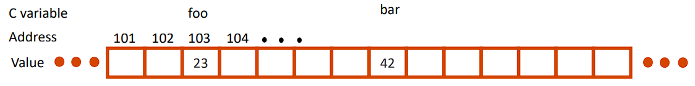

An address refers to a particular memory location

- It points to a memory location

## Pointer

Pointer: a variable that contains an address of another variable

    int *p;
    int x = 3;
    p = &x;
    printf(“p points to
        %d
        \n”, *p);
    *p = 5;

### Pointer Syntax

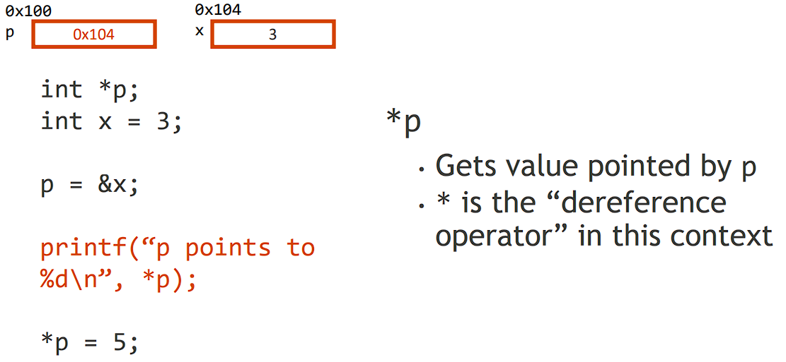

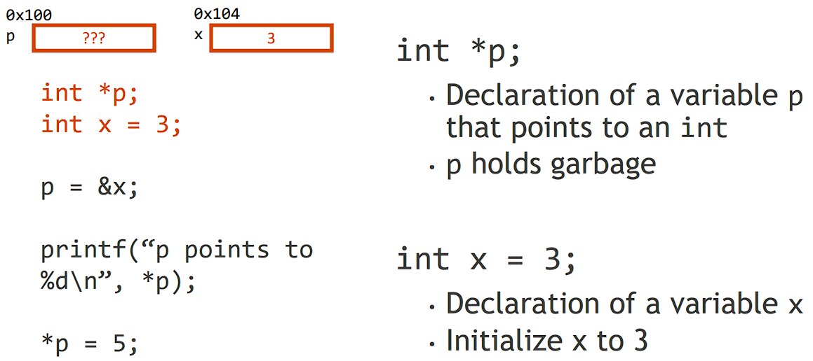

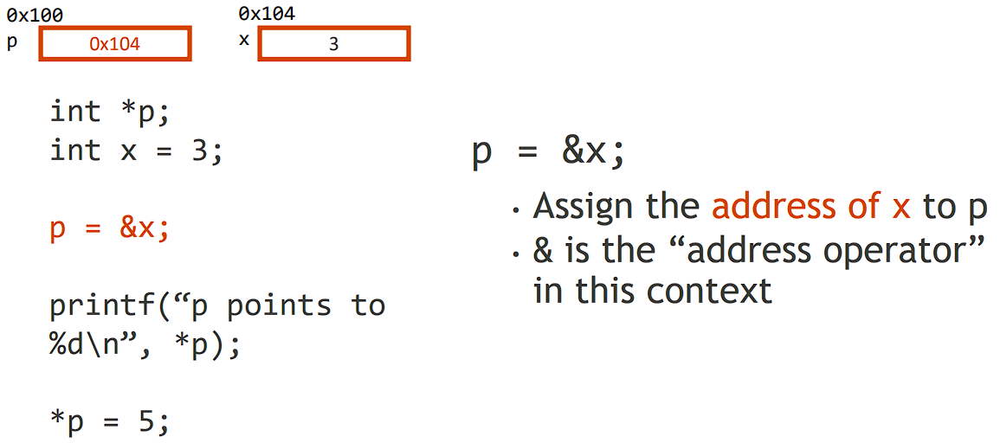

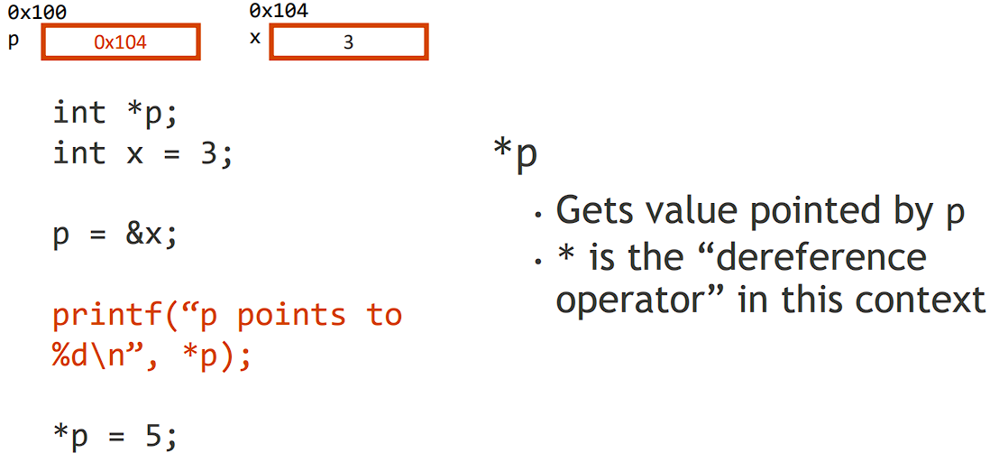

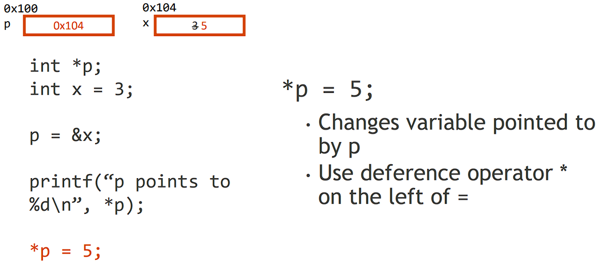

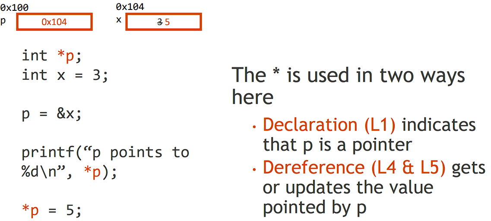

### Why Pointer

- Pointers are common in C programming

- Pointers are useful when passing parameters

- It’s easier to pass a pointer when the argument is large

> Java and C pass parameters “by value”: a procedure/function/method gets
> a copy of the parameter

    void addOne (int x){
        x = x + 1;
    }
    int y = 3;
    addOne(y);

---
    void addOne (int *p){
        *p = *p + 1;
    }
    int y = 3;
    addOne(&y);

### Common C bug: garbage address

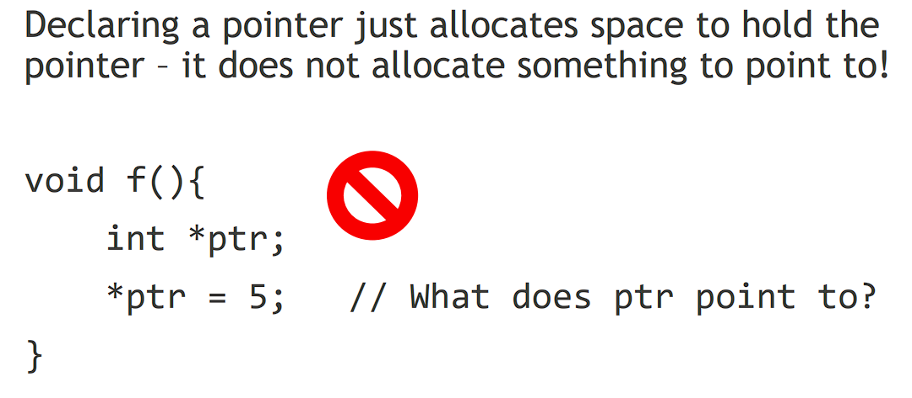

## Arrays

### C array

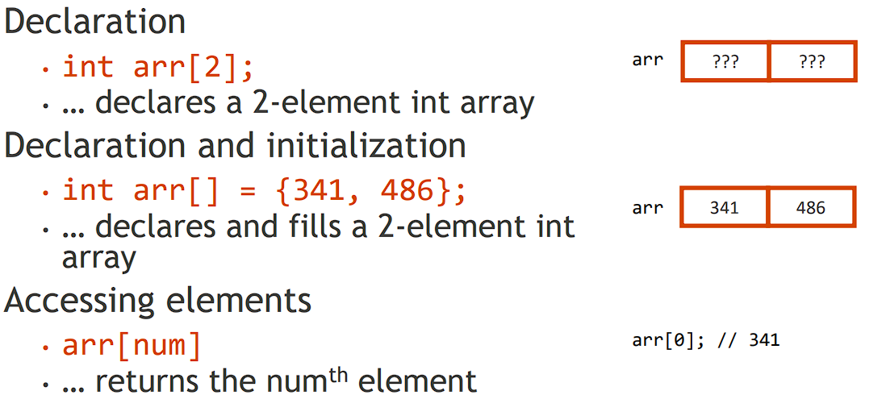

### Array & Pointer

Arrays are (almost) identical to pointers

- `char *string` and `char string[]` are nearly identical declarations
- They different in very subtle ways 
 
Accessing array elements

- `arr` is an array variable, but it looks like a pointer in many respects (though not all)
- `arr[0]` is the same as `*arr`
- `arr[2]` is the same as `*(arr+2)`

### Example

    int *p, *q, x;
    int a[4];
    p = &x;
    q = a + 1;

    *p = 1;
    *q = 2;
    *a = 3;

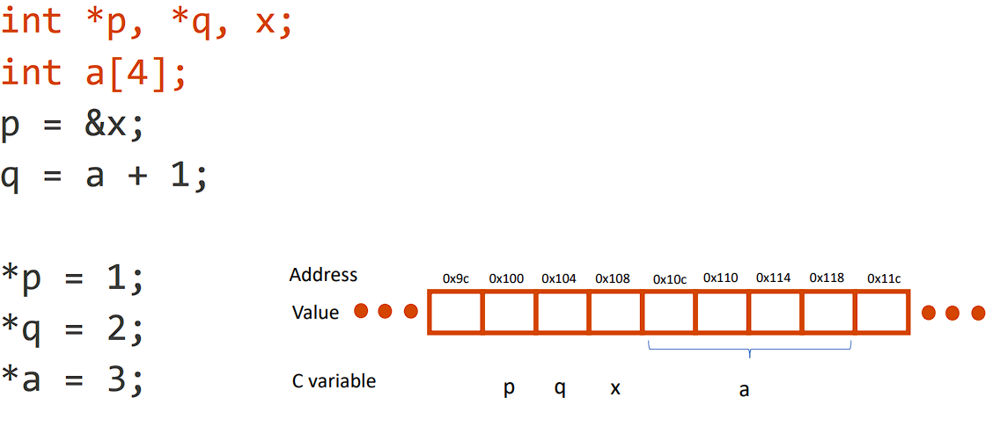

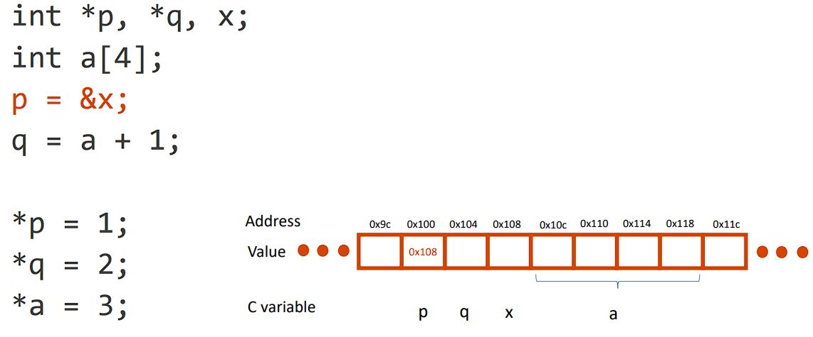

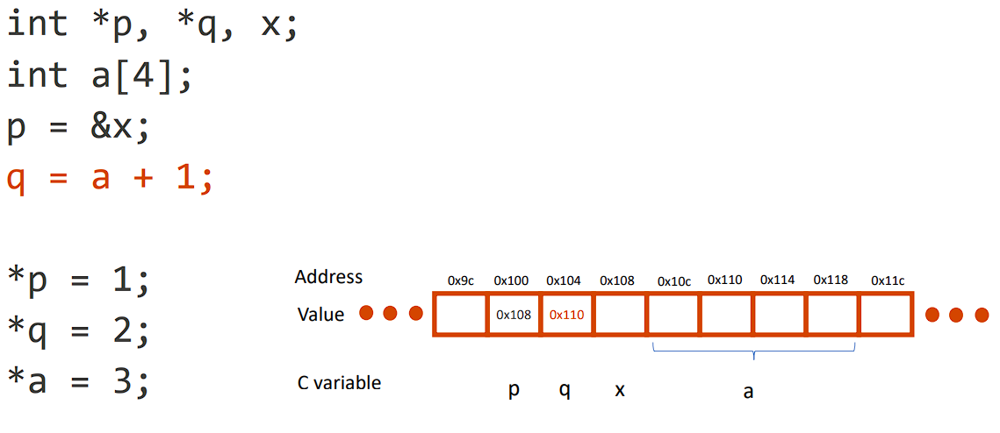

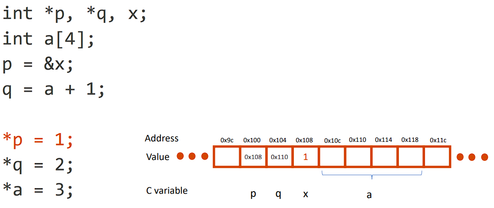

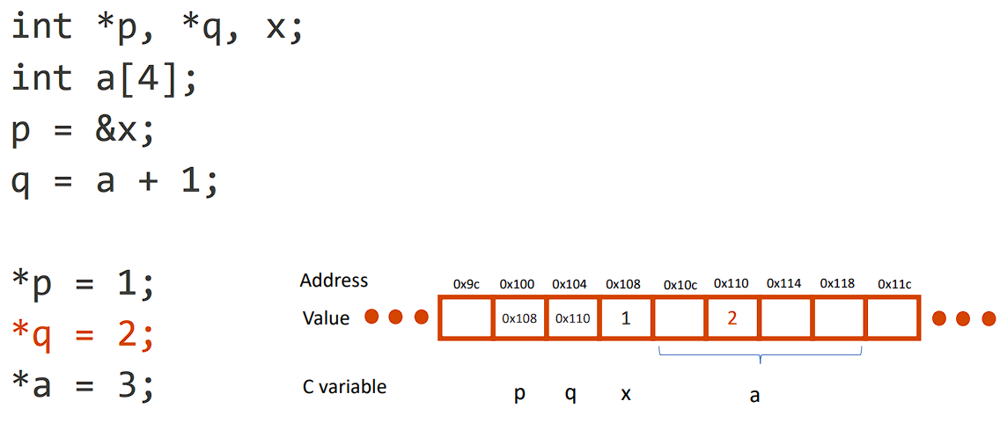

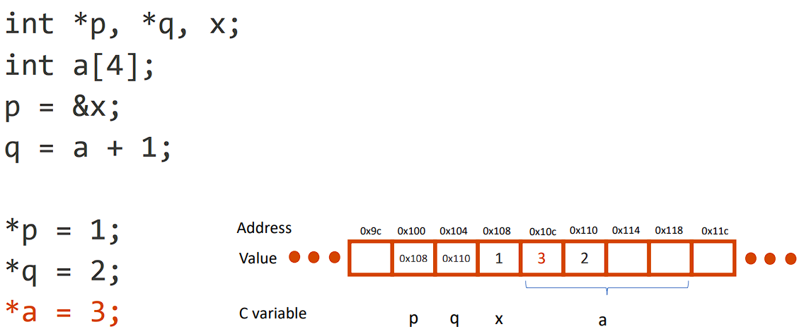

### C arrays are very primitive

- Array bounds are not checked during element access

> Consequence: we can accidently access outside an array

    int foo[ARRAY_SIZE];
    int i;
    for (i = 0; i <= ARRAY_SIZE; i+=1){
        foo[i] = 0;
    }

- An array is passed to a function as a pointer

> Consequence: The array size is lost, and we must always explicitly pass > array length. 

    int bar(int arr[], int size);
    int main(void) {
        int a[5];
        bar(a, 5); 
        }

- Declared arrays are only valid while the scope is valid
>
    char *foo() {

            char string[32];
            …
            return string;

        } // This is incorrect

> ps. C pointer & array bugs can be difficult to find!
> 
> Often manifests as segmentation faults

## Summery

Pointers point to a memory location
Arrays are a large block of memory

C is an efficient language, with little protection

- Array bounds are not checked
- Variables are not automatically initialized