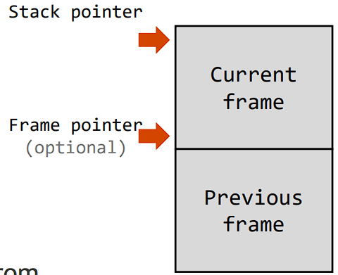
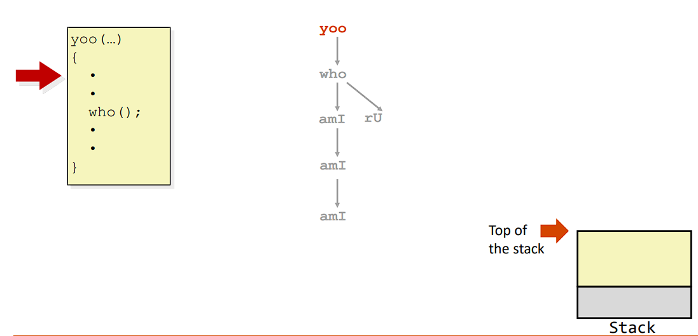
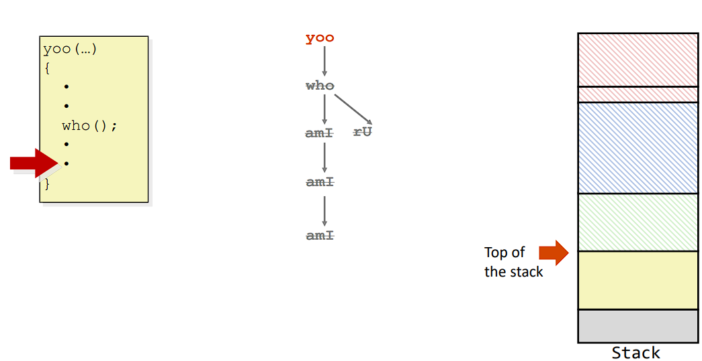

# Lecture 03 Memory management

> Some description
>
> Tags: [`CIS 341`](../../view/CIS341/index.md)
>  
> Author: `Zekai Lin`
>
> Resently Update: `Oct.6 23` `14:00`

## A program’s memory layout

<table>
  <tr>
    <td>
        
    </td>
    <td>

**Text**

- Where the binary code is stored
  
**Data**

- Where global & static variable are
- Allocated at compile-time (static)

**Heap**

- Where dynamically allocated data are
- Allocated at run-time (dynamic) by the programmer
- Think of “new” in OOP

**Stack**

- Where procedure calls are kept track of
- Allocated at run-time (dynamic) automatically
- Where local variable are


    </td>
  </tr>

</table>

## Where are variables allocated

If declared `outside` a function (`global`), it is allocated in the “**data**” area

If declared `inside` a function (`local`), it is allocated on the “**stack**”
and freed when the function returns

- No need to worry about deallocating them
- Variable does not exist anymore once a function ends!

## The Stack

Stack is a LIFO (last-in first-out) storage structure

- The **first** thing put in is the **last** thing taken out
- The **last** thing put in is the **first** thing taken out

Two main operations

- **Push**: add an item to the stack
- **Pop**: remove and return an item from the stack

## Software implementation of a stack


## Stack frame

>Stack is allocated in frames, a state for single procedure instantiation

<table>
<tr>
<td>

Contents

- Return information
- Local storage
- Temporary space

Management

- Allocated when calling

  - `Set-up` code
- Deallocated when returning
  - `Tear-down` code


</td>
<td>

</td>
</tr>

</table>

Stack & frame pointers are hidden from
the C programmer, and we’ll cover their
assembly details later.

## Call train example







## Passing pointer into the stack


## The heap

The heap is dynamic memory – memory that can be allocated, resized, and freed during the program’s runtime

- Analogous to Java’s new
- Useful for keeping data across function calls
- The biggest source of pointer bugs, memory leaks, …

## The malloc package

### malloc

``` C

#include <stdlib.h>
/*
  Allocates a block of uninitialized memory
    size_t n is a large unsigned integer type, and represents how many bytes to allocate
    Return value of void * points to a block of memory in the heap

  A return of NULL indicates allocation failure
*/
void *malloc(size_t size)
/* 
  Successful:
    Returns a pointer aligned to a 16-byte boundary
    If size == 0, returns NULL
  Unsuccessful: returns NULL (0)
*/ 

// To allocate an array of 20 ints
int *ptr = (int *) malloc(20*sizeof(int));

```

Other functions

- `calloc`: Version of malloc that initializes allocated block to zero.
- `realloc`: Changes the size of a previously allocated block.
- `sbrk`: Used internally by allocators to grow or shrink the heap

### free

``` C

void free(void *p)

// Returns the block pointed at by p to pool of available memory
// p must come from a previous call to malloc, calloc, or realloc


// ptr is a pointer to the address originally returned during malloc()
int *ptr = (int *) malloc (20*sizeof(int));
…
free(ptr) // Dynamically frees a block of memory in the heap

```

When you free memory, be suer to pass the original
address from `malloc()`. Otherwise, things go wrong!

## Memory Mismanagement

<table>
  <tr>
  <td>
        

  </td>
  <td>

`Text` and data are easy

- They never grow or shrink

`Stack` space is also easy

- Stack frames are created and destroyed automatically
- Just avoid dangling references, pointers to old stack frames

`heap` Working with the `heap` is tricky

- Memory can be allocated & deallocated at any time by the program

- Memory leak: when you forget to deallocate memory

- Use after free: if you use data after freeing it
- Double free: if you call free twice on same memory


    </td>
  </tr>

</table>

## Memory Leak

The C runtime does not check for the programmer's failure to free memory

- Java virtual machine has a separate process called the garbage collector that automatically frees unused memory
- Tradeoff between performance and ease-of-use

Symptoms of memory leak

- Initially: nothing
- Later: performance degradation
- Ultimately: program is killed by the OS

## Use after free

``` C
struct foo *f;
…
f= malloc(sizeof(struct foo));
…
free(f);
…
bar(f); // Using f after freeing
```

Dangling reference

- When you keep using a pointer, even after it has been deallocated
- Happens also when you use a pointer returned by a callee

Reads after the free may be corrupted!

## Summary

Memory address space

- `Text` where your binary code is stored
- `Data` memory allocated during compile-time
- `Heap` memory allocated dynamically & managed by the programmer
- `Stack` memory allocated dynamically & automatically managed

Beware of pointer bugs!
