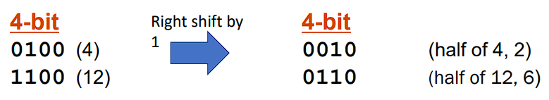
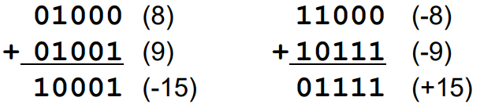

# Lecture 04 Bits & Ints

> Bits and bit-wise operations
>
> Integer representation and arithmetic
>
> Tags: [`CIS 341`](../../view/CIS341/index.md)
>  
> Author: `Zekai Lin`
>
> Resently Update: `Oct.6 23` `14:00`

## Bit = Binary digit

Digital system > finite number of symbols

Binary system > has two states: 0 and 1


We can encode & interpret sets of bits

- computers determine what to do (instruction)
- data to work on

Multiple bits can represent multiple states

- A collection of two bits has four possible states 00, 01, 01, 11
- A collection of three bits has eight possible states 000, 001, 010, 011, 100, 101, 110, 111

|  infomation  |            definition            |
| :----------: | :------------------------------: |
| Instructions | operations performed by computer |
|   Numbers    |     ints, floats, complex, …     |
|   Logical    |          true or false           |
|     Text     |       characters, strings        |
|    Images    |    pixels, colors, shapes, …     |
|    Sound     |                                  |
|     .etc     |                                  |

## Hexadecimals

> Binary representation has too many 1’s and 0’s

Base 16 number representation


Example:

- Use ‘0’ to ‘9’ and ‘A’ to ‘F’
- 13244 : 
- Write 33BC`16` in C as
  - 0x33BC
  - 0x33bc

## Boolean algebra

> Developed by George Boole –algebraic representation of logic

### AND ( & )

- A & B = 1 when both A=1 and B=1


### OR ( | )

- A | B = 1 when either A=1 or B=1


### NOT ( ~ )

- ~A = 1 when A = 0


### XOR ( ^ )

- A ^ B = 1 when either A=1 or B=1, but not both


### Quick Excercise

> Apply bit-wise operations to any data type!

~0x41 >

~0x00 >

0x6A & 0x59

0x6A | 0x59

### Shift Operation

> Left shift: x << y (shift bit-vector x left by y positions)

0x41 << 3

0x41 << 0

0x41 << 9


> Right shift: x >> y (shift bit-vector x right by y positions)

0x41 >> 3

0x41 >> 0

0x41 >> 9


## Integer Representation

> Let’s think of how we “count” integers in the first place


### Bineary to Unsigned Decimal

> Weighted position = add powers of two that have 1 in the position

``` plantext
X = 341ten
    = 3 x 10^2 + 4 x 10^1 + 1 x 10^0

X = 01101000two
    = 2^6 + 2^5 + 2^3 = 64 + 32 + 8
    = 104ten

X = 11000011two
    = 2^7 + 2^6 + 2^1 + 2^0 = 128 + 64 + 2 + 1
    = 195ten
```

> Subtract powers of two

1. Subtract the largest power of two less than or equal to the number
2. Put a one in the corresponding bit position
3. Keep subtracting until result is zero

``` plantext
X = 341ten 

341 – 256 = 341 – 2^8 = 85
85 – 64 = 85 – 2^6 = 21
21 – 16 = 21 – 2^4 = 5
5 – 4 = 5 – 2^2 = 1
1 – 1 = 2 – 2^0 = 0

X = 101010101two
```

### Signed integer: two’s complement

For each positive number (X),

assign value to its negative (-X)

such that X + (-X) = 0 with normal addition


If the number is positive or zero

- Normal binary representation, zero in MSB

If the number is negative

- Start with the positive
- Flip every bit (basically taking the 1’s complement)
- Then add one


### Binary to Decimal

MSB has weight of -2n-1 All other positions have weight of 2i (i is position)


## Integer arithmetic

### Addition

> 2’s complementary addition is just binary addition


### Substraction

> Negate subtrahend (2nd number) and add


### sign extension

> When increasing the number of bits for integer representation

If we just pad with zeroes on the left:


Instead, replicate the MSB (the sign bit)


### Logical shift for unsigned

`Logical shift`: fill with 0’s on the left



### Arithmetic shift for signed

`Arithmetic shift`: replicate most significant bit on left


## Overflow

> If the operands are too big, then the sum cannot be represented correctly



Overflow if:

- Signs of both operands are the same,
- But the sign of the sum is different

### n-bit signed vs. n-bit unsigned

> Regardless of signed or unsigned, n-bit represents 2n different values

4-bit signed

- From -8 to 7

4-bit unsigned

- From 0 to 15


### Casting

Explicit casting

``` C
int sx, sy;
unsigned int ux, uy;
sx = (int) ux;
uy = (unsigned int) sy;
```

Implicit casting

- Via assignments and procedure calls

``` C
sx = ux; 
uy = sy; 

int fun(unsigned int a);
uy = fun(sx);
```

### Casting Surprises

> If there is a mix of unsigned and signed in a single expression, `signed values implicitly cast to unsigned`.

0 == (unsigned int) 0 ?

-1 < 0 ?

-1 < 0U ?

1 > -5 ?

1 > (unsigned int) -5 ?


``` plaintext
0 == (unsigned int) 0:

This statement compares an integer literal 0 with the result of casting 0 to an unsigned integer (unsigned int) 0.
The value 0 remains the same after the cast.
So, 0 == 0 is true, as both sides of the equality are equal.
-1 < 0:

This statement compares a signed integer -1 with a signed integer 0.
Since -1 is indeed less than 0, this statement is true.
-1 < 0U:

This statement compares a signed integer -1 with an unsigned integer 0U.
In this comparison, the -1 is implicitly converted to an unsigned integer. The result of this conversion is a very large positive value (the exact value depends on the size of an int on your system, but it's typically 2^32 for a 32-bit int).
So, in practice, -1 is not less than 0U because of the conversion. This statement is false.
1 > -5:

This statement compares a signed integer 1 with a signed integer -5.
Since 1 is greater than -5, this statement is true.
1 > (unsigned int) -5:

This statement compares a signed integer 1 with the result of casting -5 to an unsigned integer (unsigned int) -5.
In this comparison, -5 is implicitly converted to an unsigned integer. The result of this conversion is a very large positive value (the exact value depends on the size of an int and an unsigned int on your system, but it's typically 2^32 for a 32-bit int and unsigned int).
So, in practice, 1 is not greater than (unsigned int) -5 because of the conversion. This statement is false.

```

In summary:

Statements 1 and 2 are true.

Statement 3 is false.

Statements 4 and 5 are false due to the implicit conversion when comparing a signed and an unsigned integer.

## Summery

> Crux of the problem: we can’t have infinite bits

Two’s complement representation

- Limited number of bit, potential overflow

Signed vs. unsigned

- Same bit representation
- Different interpretation
- Sometimes different operations (example: right shift)
- What happens when they are mixed
  