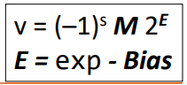

# Lec05: Floats

> Some description
>
> Tags: [`CIS 341`](../../view/CIS341/index.md)
>  
> Author: `Zekai Lin`
>
> Resently Update: `Oct.4 23` `16:18`

## Keys

- float conversion

## Fractional Binary Numbers

> Bits right of the binary point represent fractional powers of 2

### Example

Observations

- Divide by 2 by shifting right
- Multiply by 2 by shifting left
- Numbers of form 0.11111…2 are almost 1.0
- 1/2 + 1/4 +1/8 + … +1/2i converge to 1.0

### Representable numbers

Limitation #1

- Can only exactly represent numbers of the form x/2k
  - In decimal, 1/3 is 0.3333333…
  - In binary, 1/3 is 0.010101010101

Limitation #2

- Just one setting of binary point within the w-bits

### The importance of floating point

> Missile interception failure on Feb. 25, 1991

- Internal system clock incremented every 0.1 seconds, and to compute 1 second, counter was multiplied by 1/10.

- 1/10 = 0.0001100110011001100…2, and this was stored as 24-bits.

- Introduced an error of 0.00000000000000000000000110011002, or 0.000000095 seconds for every 0.1 second.

- After 100 hours of operation, the error was large enough to miss the interception.

### IEEE floating point (IEEE 754)

> Established in 1985 as a uniform standard for floating point

Supported by all major CPUs

- Some don’t fully implement IEEE 754 (some GPUs)

Driven by numerical concerns

- Numerical analysts predominated over hardware designers in defining the standard
- Hard to make fast in hardware

### Floating point representation

> 34110 = (-1)0 × 1.01010101 × 2^8

Numerical form

- (-1)^s × M × 2^E
- Sign bit `s` determines whether the number if negative or positive
- Mantissa `M` is normally a fractional value in range of [1.0, 2.0)
- Exponent `E` weighs value by power of two

Encoding

- MSB **s** is sign bit `s`
- **exp** field encodes `E` (but is not equal to E)
- **frac** field encodes `M` (but is not equal to M)

### Presion Options

Single precision (32-bits): float
> ≈ 7 decimal digits, 10^(±38)

Double precision (64-bits): double
> ≈ 16 decimal digits, 10^(±308)

Other formats exist

- Half precision (16-bits)
- Quad precision (128-bits): long double

> Three kinds of floating point numbers

---

> Visualization of the floating point encodings

#### Normalized values

> When exp ≠ 000…0 and exp ≠ 111…1

Exponent coded as a biased value: E = exp – Bias

- `exp` : unsigned value of `exp` field
- Bias: 2k-1-1, where k is the number of exponent bits 
  - Single precision: 127 (`exp` : 1 to 254, E: -126 to 127)
  - Double precision: 1023 (`exp`: 1 to 2046, E: -1022 to 1023)

Mantissa coded with implied leading 1: M = 1.xxx…x2
• xxx.x: bits of the `frac` field
• Minimum when `frac` is 000…0 (M = 1.0)
• Maximum when `frac` is 111…1 (M ≈ 2.0)

#### Normalized encoding example

> float f = 341.0;

341 = 101010101`2` = 1.01010101 × 2^8

Mantissa

- M = 1.01010101
- frac = 010101010000000000000002
  
Exponent

- E = 8
- Bias = 127
- Exp = 135 = 100001112

Result

#### Denormalized values

> When exp = 000…0

Exponent value: E = 1- Bias

- Bias is same as the case for normalized (2k-1-1)

Mantissa coded with implied leading 0: M = 0.xxx…x2

- xxx.x: bits of the frac field

Examples

- exp = 000…0, frac = 000…0 • Represents zero value (+0 when s = 0, -0 when s=1)
- exp = 000…0, frac ≠ 000…0 • Equi-spaced numbers close to zero