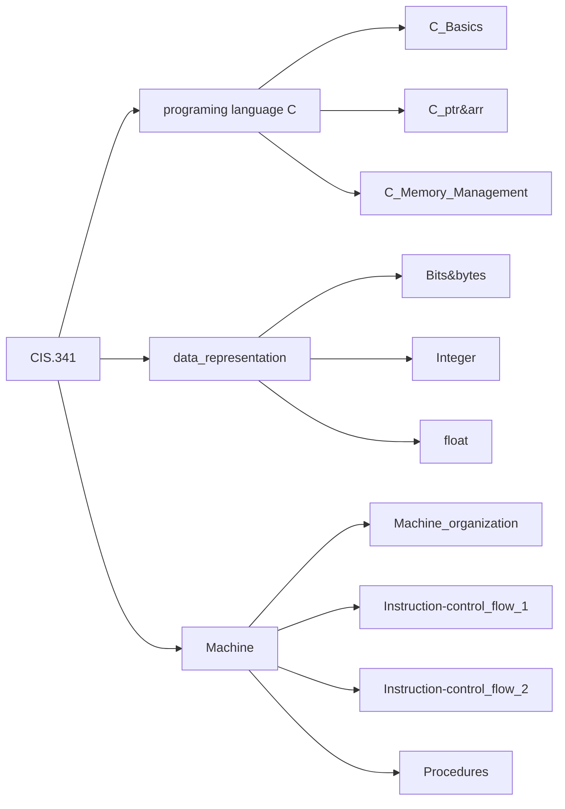

# Computer Organization & Programming Systems

> Note for `CIS.341`.`M001`.`FALL23`.`Cptr Organ and Progrmmng Syst` `14189`.`1241`
>
> Author: `Zekai Lin`
>
> Resently Update: `Oct.4 23` `16:18`

## Outline

- [Syllabus](../../res/cis341Fa23Syllabus.pdf)  
- [Lec01-C_Basics](../../nodes/001/index.md)
- [Lec02-C_ptr&arr](../../nodes/002/index.md)
- [Lec03-C_Memory Management](../../nodes/003/index.md)
- [Lec04-Bits & Ints](../../nodes/004/index.md)
- [Lec05-Floats](../../nodes/006/index.md)
